# ⚙️ 13.2.7 Configure a Basic WLAN on the WLC — Cisco Packet Tracer Lab

> Connect to a Wireless LAN Controller GUI, create and secure a new WLAN, then connect a wireless host and verify connectivity.

---

## 📋 Overview

This lab walks through configuring a basic WLAN on a Cisco Wireless LAN Controller (WLC). It covers logging into the WLC web GUI, reviewing the Monitor summary, creating a new WLAN, applying WPA2-PSK security, and connecting a wireless host to the network.

**File:** `13_2_7_Packet_Tracer_-_Configure_a_Basic_WLAN_on_the_WLC.pka`  
**Platform:** Cisco Packet Tracer  
**Devices:** R-1, SW-1, WLC-1, LAP-1, Admin PC, Server, Wireless Host

---

## 🖧 Network Topology

### Before Connection
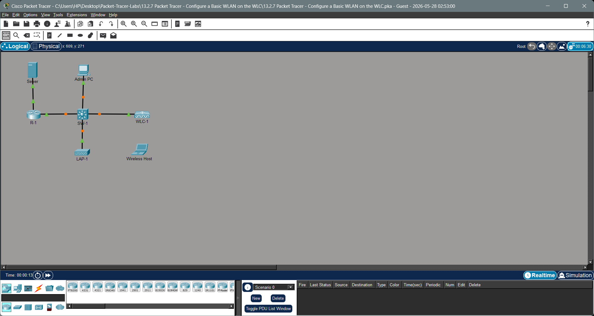

### After Connection
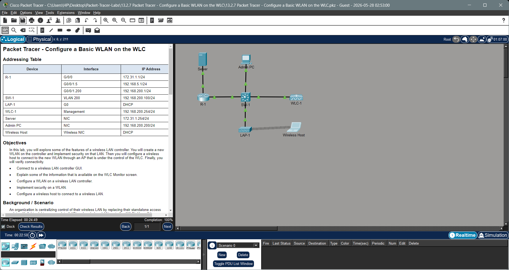

### Addressing Table

| Device | Interface | IP Address |
|---|---|---|
| R-1 | G/0/0 | 172.31.1.1/24 |
| R-1 | G0/0/1.5 | 192.168.5.1/24 |
| R-1 | G0/0/1.200 | 192.168.200.1/24 |
| SW-1 | VLAN 200 | 192.168.200.100/24 |
| LAP-1 | G0 | DHCP |
| WLC-1 | Management | 192.168.200.254/24 |
| Server | NIC | 172.31.1.254/24 |
| Admin PC | NIC | 192.168.200.200/24 |
| Wireless Host | Wireless NIC | DHCP |

---

## 🎯 Objectives

- Connect to a wireless LAN controller GUI.
- Explain some of the information available on the WLC Monitor screen.
- Configure a WLAN on a wireless LAN controller.
- Implement security on a WLAN.
- Configure a wireless host to connect to a wireless LAN.

---

## 🛠️ Configuration Steps

### Part 1 — Monitor the WLC

Open the **Admin PC** browser and navigate to `https://192.168.200.254`. Log in with username `admin` and the configured password:


After logging in, the **Monitor > Summary** screen displays key controller information including management IP, software version, system name, uptime, and the Access Point Summary:


The summary confirms **WLC-1** is managing **1 AP** (LAP-1) with both 802.11a/n/ac and 802.11b/g/n radios active.

---

### Part 2 — Create and Enable the WLAN

#### Step 1 — Open the WLANs Page

Navigate to **WLANs** in the top menu. The WLANs list is initially empty:

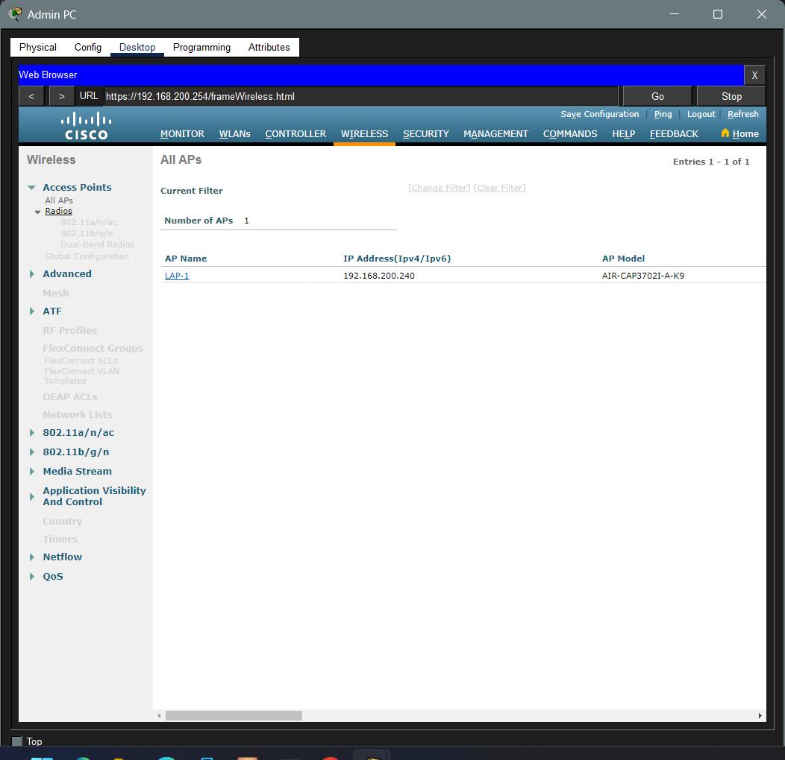

Click **Create New** and then **Go**.

#### Step 2 — Name the WLAN and Set the SSID

Fill in the new WLAN form:

- **Profile Name:** `Floor 2 Employees`
- **SSID:** `SSID-5`
- **ID:** `5`


Click **Apply**.

#### Step 3 — Enable the WLAN and Assign the Interface

On the **General** tab of the WLAN edit page:

- Check **Status: Enabled**
- Set **Interface/Interface Group(G):** `WLAN-5`

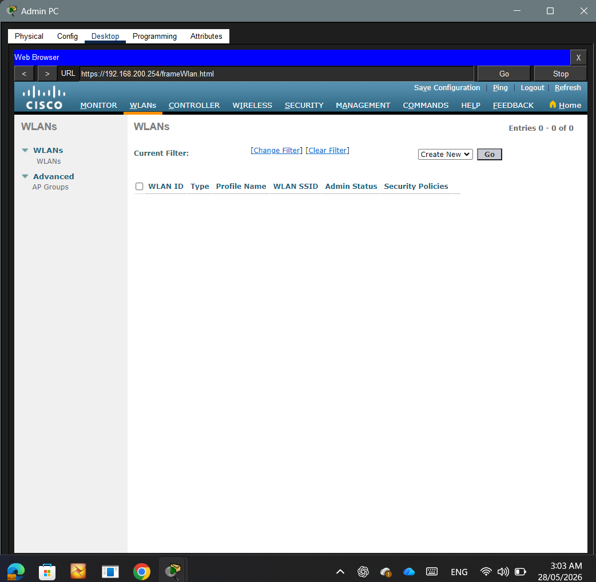

#### Step 4 — Verify the Advanced Tab (FlexConnect)

Navigate to the **Advanced** tab. Confirm **FlexConnect Local Switching** and **FlexConnect Local Auth** are both enabled:

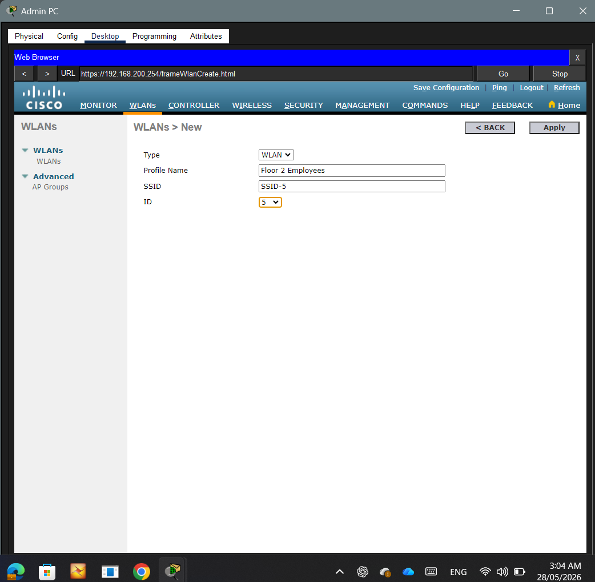

Click **Apply**.

---

### Part 3 — Secure the WLAN

#### Step 1 — Configure Layer 2 Security

On the **Security** tab, select **Layer 2** and set:

- **Layer 2 Security:** `WPA+WPA2`
- **WPA2 Policy:** Enabled
- **WPA2 Encryption:** `AES`
- **Authentication Key Management — PSK:** Enabled

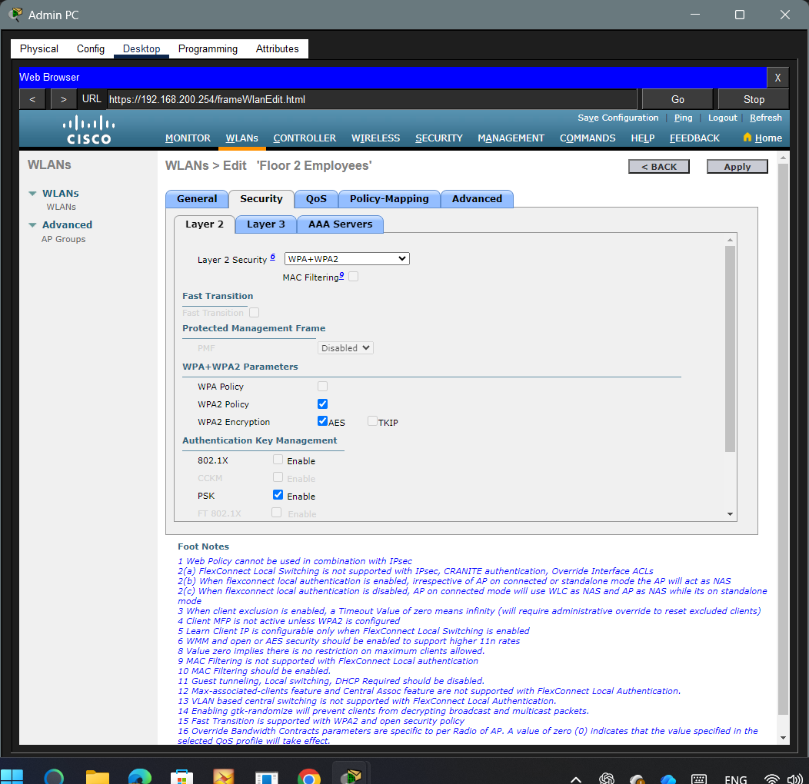

#### Step 2 — Set the PSK Passphrase

Scroll down to the **PSK** field. Set **PSK Format** to `ASCII` and enter the passphrase:

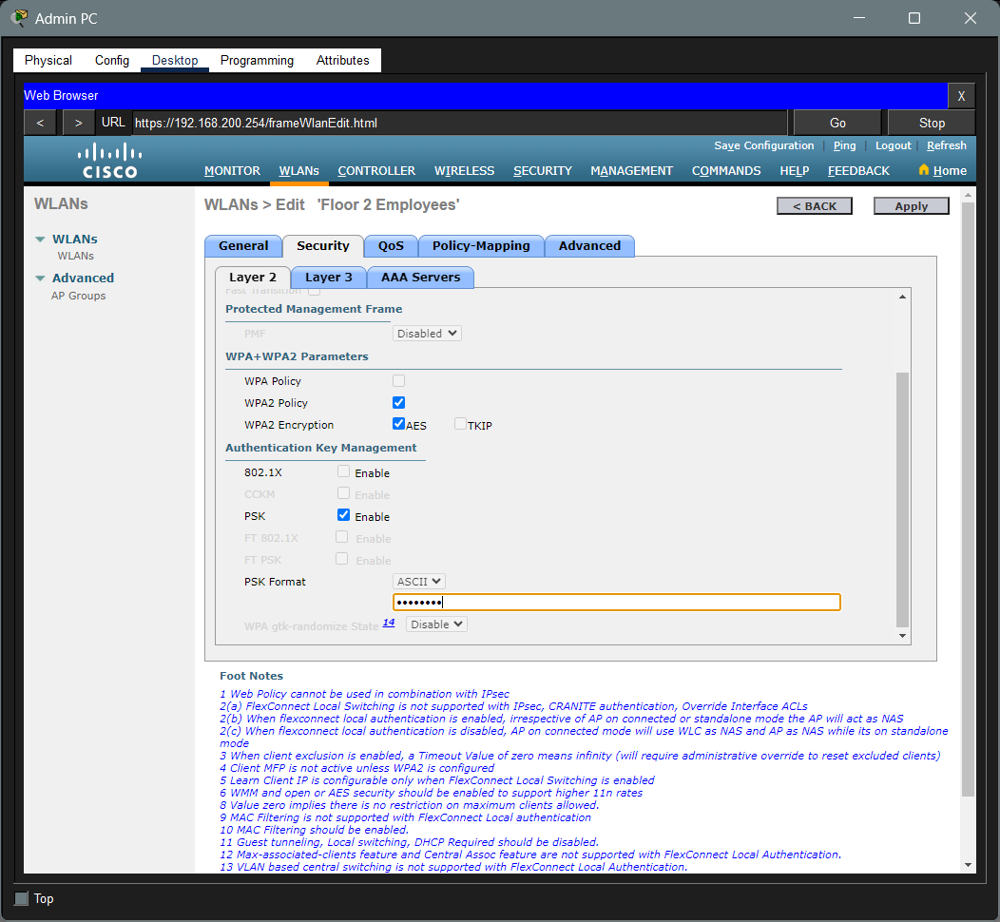

Click **Apply**. The WLANs list now shows the configured WLAN with **[WPA2][Auth(PSK)]** security:

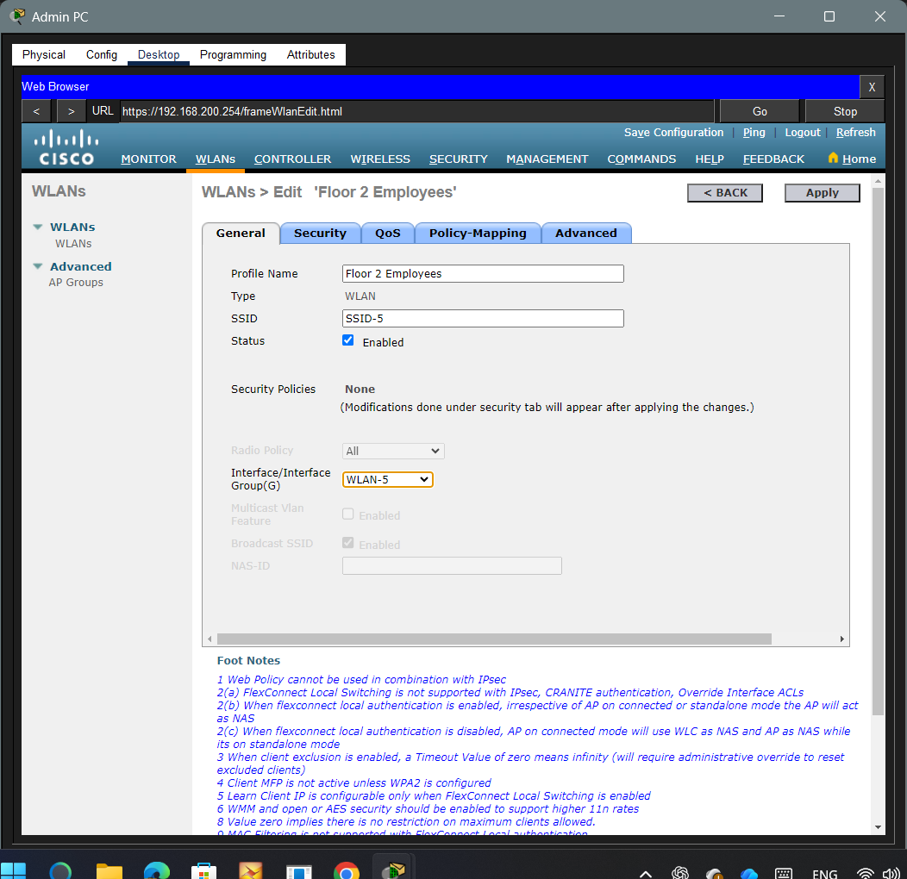

---

### Part 4 — Verify the Wireless Access Point

Navigate to **Wireless > Access Points > All APs** to confirm **LAP-1** is registered to the controller at `192.168.200.240`:

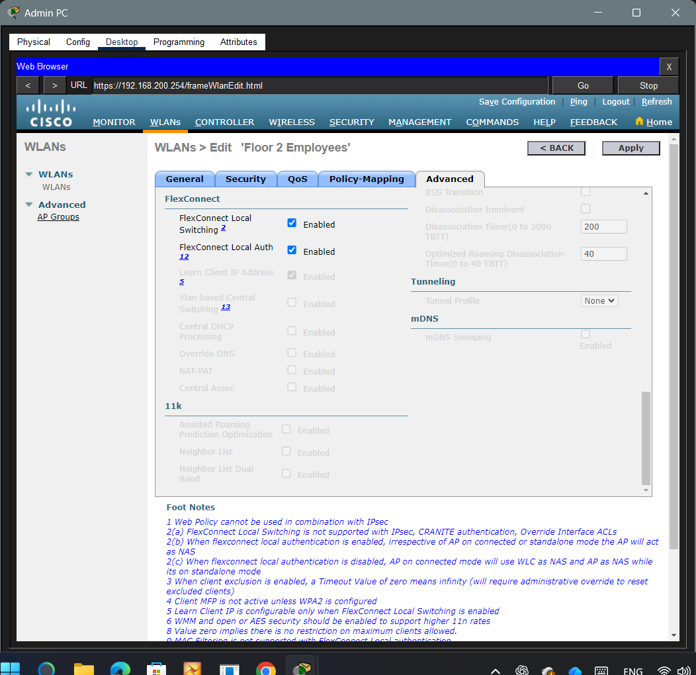

---

### Part 5 — Connect a Host to the WLAN

On the **Wireless Host**, open the Desktop tab and launch the **Wireless Network Monitor**. Click the **Connect** tab. Select **SSID-5** from the list and click **Connect**:

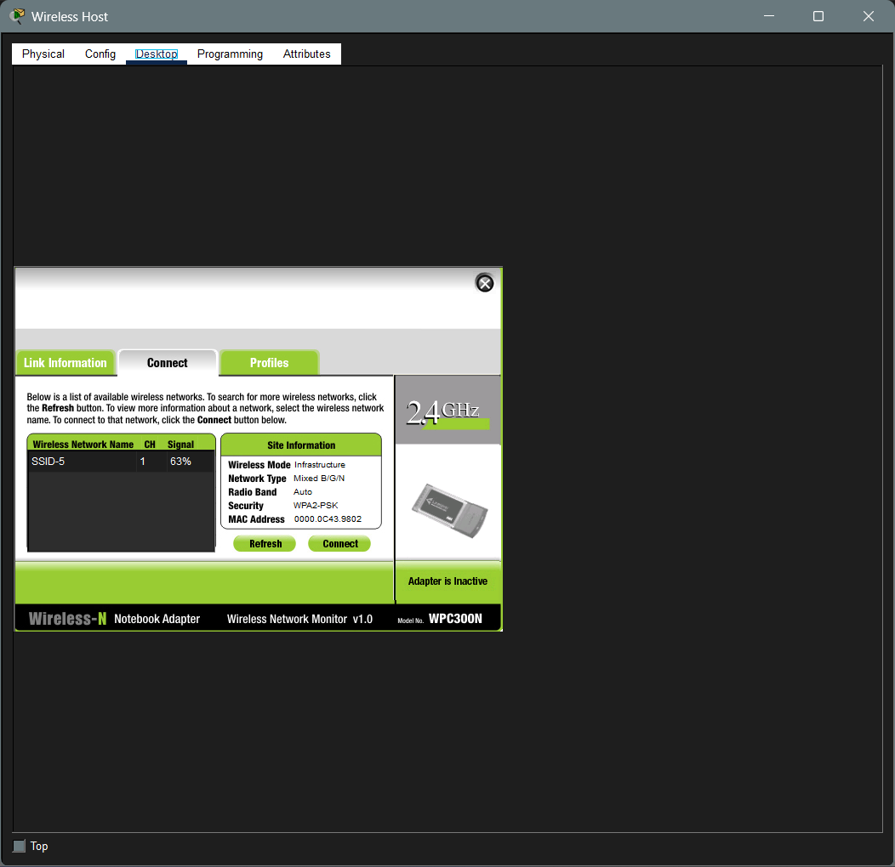

Enter the PSK passphrase when prompted. The host will associate and receive an IP via DHCP.

---

### Part 6 — Verify Connectivity

From the Wireless Host, open the **Command Prompt** and ping the Server or another device to confirm end-to-end connectivity:


---

### Part 7 — Verify the WLC Settings

Return to the WLC GUI and navigate to **Monitor > Clients** to confirm the Wireless Host appears as a connected client:

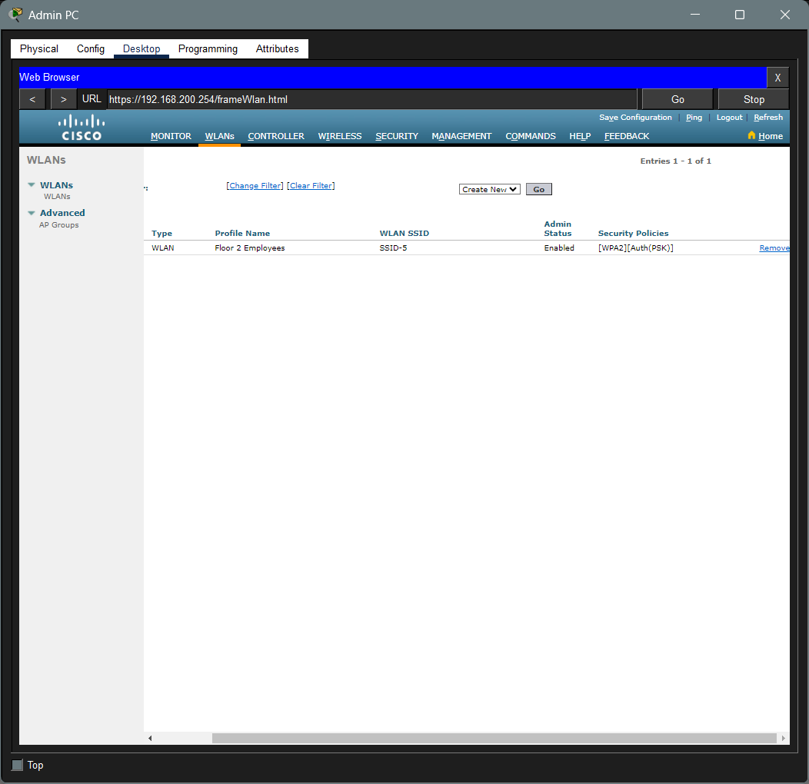

---

## 📌 Key Concepts

| Concept | Detail |
|---|---|
| **WLC** | Centrally manages multiple lightweight access points (LAPs) |
| **LAP** | Lightweight AP — offloads configuration and control to the WLC |
| **SSID** | The wireless network name broadcast to clients |
| **Profile Name** | Administrative label for the WLAN on the WLC |
| **WPA2-PSK** | Wi-Fi Protected Access 2 with Pre-Shared Key authentication |
| **AES** | Advanced Encryption Standard — the encryption algorithm used with WPA2 |
| **FlexConnect** | Allows APs to locally switch traffic even if WLC connectivity is lost |
| **WLAN Interface** | Maps the WLAN to a VLAN/interface on the WLC (e.g., WLAN-5) |
| **DHCP** | Wireless clients receive IP addressing automatically from the server |

---

## 📁 Repository Structure

```
.
├── 13_2_7_Packet_Tracer_-_Configure_a_Basic_WLAN_on_the_WLC.pka
├── README.md
├── Topology-before-connection.png
├── Topology-after-connection.png
├── Monitor-the-WLC-login.png
├── WLC-Monitor-Summary-screen.png
├── Create-and-enable-the-WLAN.png
├── Create-and_enable-the-WLAN-2.png
├── Create-and_enable-the-WLAN-3.png
├── Create-and_enable-the-WLAN-4.png
├── Create-and-enable-the-WLAN-5.png
├── Create-and-enable-the-WLAN-6.png
├── Secure-the-WLAN.png
├── Secure-the-WLAN-1.png
├── Connect-a-Host-to-the-WLAN.png
├── verify-connectivity.png
└── Verify-the-Settings.png
```

---

## 🚀 Getting Started

1. Open Cisco Packet Tracer
2. Load `13_2_7_Packet_Tracer_-_Configure_a_Basic_WLAN_on_the_WLC.pka`
3. Click on **Admin PC** and open the **Desktop > Web Browser**
4. Navigate to `https://192.168.200.254` and log in with `admin` credentials
5. Follow the steps above to create, secure, and verify the WLAN
